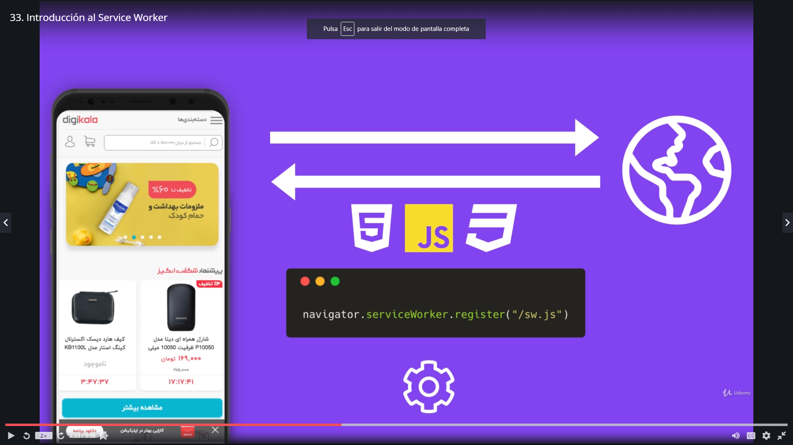

<!--  -->
 
# información acerca del curso
⭐⭐⭐⭐⭐ 4,8 (1.216 valoraciones)

### Este curso incluye
- [x] 14,5 horas de vídeo bajo demanda
- [x] 32 artículos
- [x] 42 recursos descargables
- [x] Acceso de por vida
- [x] Acceso en dispositivos móviles y TV
- [x] Certificado de finalización

### Lo que aprenderás
- [x] Convertir cualquier aplicación web o página web en una PWA
- [x] Recibir Push Notifications a tu aplicación web o página web
- [x] Postear información inclusive si tu webapp o sitio web esta offline
- [x] Uso de recursos nativos del dispositivo
- [x] Crear tu propio Push Server
- [x] Manejar diferentes técnicas para que tu aplicación funcione offline
- [x] Conocer a profundidad el Fetch API
- [x] Y mucho más

## Contenido del curso 

**Módulo I : Introducción** | **09:22 min**
------------ | -------------
Introducción |  01:01
¿Cómo funcionará el curso? | 01:48
¿Cómo hacer preguntas?  | 02:50
Instalaciones necesarias para seguir el curso | 01:56
Instalar Git y configuración básica | 01:47
**Módulo II : Fundamentos de las aplicaciones web progresivas** | **20:25 min**
Introducción a la sección  |  00:54
Temas puntuales de la sección | 00:12
¿Qué son las aplicaciones web progresivas? | 03:47
¿Por qué construir una PWA?  | 05:39
Conceptos clave de las PWA | 09:40
Material de la sección  | 00:13
**Módulo II : Fundamentos de las aplicaciones web progresivas** | **20:25 min**
Introducción a la sección  |  00:54
Temas puntuales de la sección | 00:12
¿Qué son las aplicaciones web progresivas? | 03:47
¿Por qué construir una PWA?  | 05:39
Conceptos clave de las PWA | 09:40
Material de la sección  | 00:13
**Reforzamiento Promesas, Fetch API y HttpServer** | **01:39:49 Horas**
Introducción a la sección  | 01:39
Temas puntuales de la sección | 00:21
Inicio del proyecto y recomendación | 07:21
Promesas 101: Problemática | 09:33
Resolución del problema usando promesas | 08:19
Manejo de errores en las promesas | 07:39
Promise All | 09:01
Promise Race | 04:38
Material adicional sobre promesas | 00:16
Origenes del Fetch - XMLHttpRequest | 07:01 
Fetch API | 08:22
Fetch POST / PUT | 05:10
Fetch Blob | 06:09
Response.clone() | 05:00
Manejo de respuestas y errores | 05:03
Leer archivos HTML | 04:25
Tarea: Reforzamiento sobre las promesas y fetch | 09:31
Documentaciones adicionales | 00:10
Código fuente de la sección | 00:10
**Service Worker y Fetch Event** | **01:02:25 Horas**
Introducción a la sección  | 02:56
Temas puntuales de la sección | 00:16
Introducción al Service Worker | 05:56
Inicio del proyecto - Service Worker básico | 05:49
Instalación del Service Worker | 10:20
Service Worker - Fetch Event | 11:20
Formas válidas para realizar peticiones desde el evento Fetch | 05:51
Modificando la respuesta de la petición Fetch | 04:37
Tarea - Interceptar y modificar peticiones | 03:28
Manejo de errores en el Fetch Event | 11:25
Nota: Manejo de errores en el Fetch | 00:12
Código fuente de la sección | 00:14
Examen sobre Service Workers | 10 preguntas

# Curso de udemy PWA 

- Profesor: Fernando Herrera. 

## Fundamentos

Para porder trabajar necesitaremos un servidor de archivos estáticos. Para esto realizaremos la instalación de http-server aunque otra opción podría ser la extención de Visual Studio Code [Live Server-GitHub](https://github.com/ritwickdey/vscode-live-server)
### intalar  http-server

1. `npm install -g http-server`
2. Luego para ejecutar el servidor
3. `http-server`

# Documentación MDN web docs
- [Promesas](https://developer.mozilla.org/es/docs/Web/JavaScript/Referencia/Objetos_globales/Promise/prototype)
- [Promise.all()](https://developer.mozilla.org/es/docs/Web/JavaScript/Referencia/Objetos_globales/Promise/all)
- [Promise.race()](https://developer.mozilla.org/es/docs/Web/JavaScript/Referencia/Objetos_globales/Promise/race)
- [Estado de las Promesas](Doc/estados-de-las-promesas.pdf)
- [Fetch](https://developer.mozilla.org/en-US/docs/Web/API/Response)
- [Utilizando Fetch](https://developer.mozilla.org/es/docs/Web/API/Fetch_API/Utilizando_Fetch)
- [URL](https://developer.mozilla.org/en-US/docs/Web/API/URL)
- [HmlHttpRequest](https://developer.mozilla.org/en-US/docs/Web/API/XMLHttpRequest/readyState)

### Ejercicios Promesas

[prom-1.js](https://github.com/emilianoduran/pwaUDEMY/blob/fundamentos/Unidades/01-funamentos/js/prom-1.js) |
[prom-2.js](https://github.com/emilianoduran/pwaUDEMY/blob/fundamentos/Unidades/01-funamentos/js/prom-2.js) |
[prom-3.js](https://github.com/emilianoduran/pwaUDEMY/blob/fundamentos/Unidades/01-funamentos/js/prom-3.js) |
[prom-4.js](https://github.com/emilianoduran/pwaUDEMY/blob/fundamentos/Unidades/01-funamentos/js/prom-4.js) |

### Ejercicios Fetch API

[fetch-1.js](https://github.com/emilianoduran/pwaUDEMY/blob/fundamentos/Unidades/01-funamentos/js/fetch-1.js) |
[fetch-2.js](https://github.com/emilianoduran/pwaUDEMY/blob/fundamentos/Unidades/01-funamentos/js/fetch-2.js) |
[fetch-3.js](https://github.com/emilianoduran/pwaUDEMY/blob/fundamentos/Unidades/01-funamentos/js/fetch-3.js) |
[fetch-4.js](https://github.com/emilianoduran/pwaUDEMY/blob/fundamentos/Unidades/01-funamentos/js/fetch-4.js) |
[fetch-5.js](https://github.com/emilianoduran/pwaUDEMY/blob/fundamentos/Unidades/01-funamentos/js/fetch-5.js) |
[fetch-6.js](https://github.com/emilianoduran/pwaUDEMY/blob/fundamentos/Unidades/01-funamentos/js/fetch-6.js) |
[tarea.js](https://github.com/emilianoduran/pwaUDEMY/blob/fundamentos/Unidades/01-funamentos/js/tarea.js) |

## Service Worker y Fetch Event

El service worker es el corazón de una pwa. Un service worker funciona como un proxy. Cuando se hace una petición, antes de llegar al servidor, esa petición será recibida por el SW. Si el recurso se encuentra almacenado en caché, el service worker lo retornará, en caso de no disponer de dicho recurso la petición seguirá camino hasta el servidor y cuando llegue la respuesta el service worker volverá a interceder para almacenar esos recursos en caché. Por citar un ejemplo.
También en este capítulo veremos el fech de eventos del service worker que no es lo mismo que el fetch API.
> Es muy importante que para que un SW funcione correctamente se necesita un servicio https:// , como el que ofrece [firebase hosting](https://firebase.google.com/docs/hosting/?hl=es-419) que es gratuito. 

## Resumen puntual de la sección:

- Esta sección está enfocada principalmente en el tema del service worker, ¿cómo instalarlo? y ¿qué podemos hacer con él?

- También aprenderemos a modificar respuestas que es un tema crucial cuando llegues al tema del manejo del cache y respuestas offline.

- Pero primero necesito que comprendamos qué puede hacer el service worker y sobre todo, que comprendan el poder que tiene sobre toda su aplicación web

### Introducción a los Services Workers
Un sw se compone de muchos eventsListeners que escuchan eventos como

Eventos | Descripción
------------ | -------------
install | Cuando se instala
activate | Cuando se activa el sw
push | Cuando recibe una notificación push
fetch | Cuando hace algún fetch
sync | Cuando se recupera la conexión a internet y necesita sincronizar la data
message | Cuando recibe algun mensaje de la app

<figure>
  
  <figcaption>¿Cómo trabaja un service worker?</figcaption>
</figure>